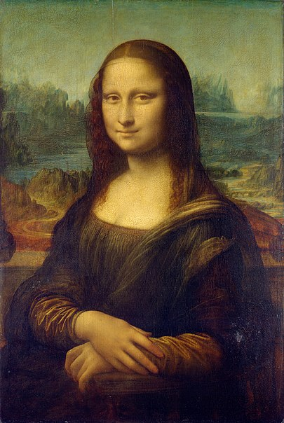
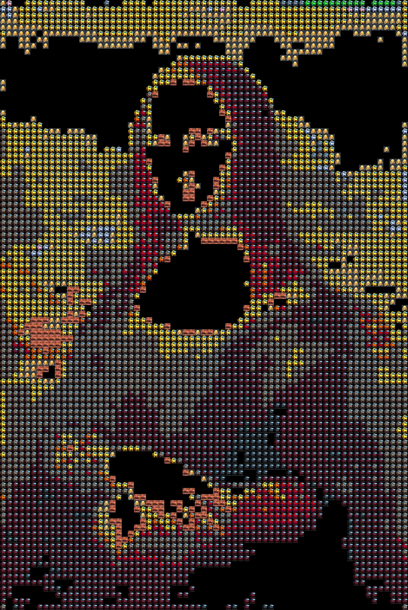

<div align="center">

<h1 align="center">SussyImage</h1>


<br/>
Converts an image into funny, smaller amongus characters
</div>


***

### Demo

Mona Lisa                 |  Lona Misa (Made up of AmongUs characters)
:-------------------------:|:-------------------------:
  |  

### Installation
```
git clone https://github.com/Dhravya/sussyimage
cd SussyImage
pip install -r requirements.txt
```

### Usage
```
python ./src/main.py
```

### License
This project is licensed under the MIT license
### Show your support
Leave a ⭐ if you like this project

***
Readme made with 💖 using [README Generator by Dhravya Shah](https://github.com/Dhravya/readme-generator)